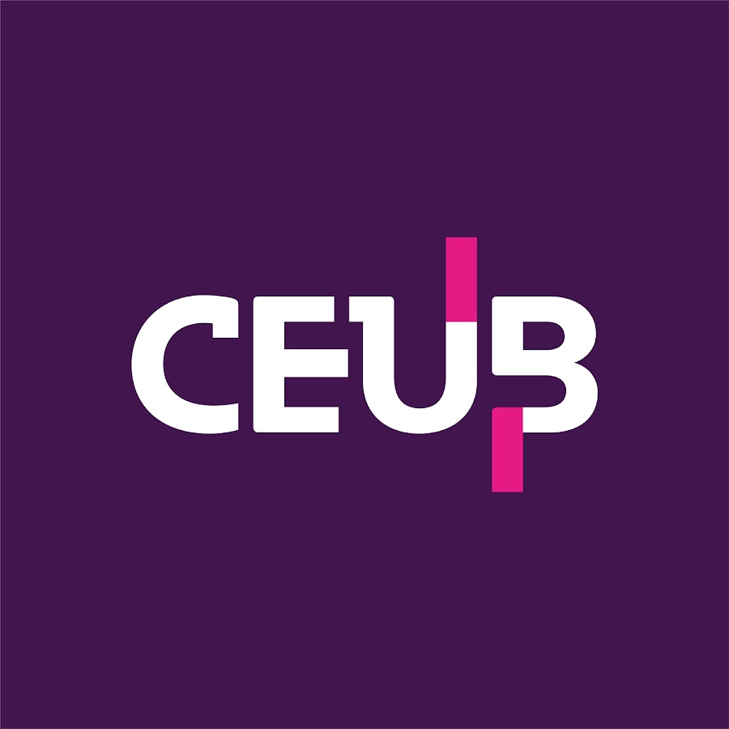

  

**# Qualidade de Software com a ISO/IEC 25010**

****Material do estudante****  

****Curso:**** Engenharia de Software  

****Disciplina:**** Engenharia de Requisitos  

****Profª:**** Kadidja Valéria  

****Tema:**** Modelo de qualidade de produto da ISO/IEC 25010

**---**

**## 1. Apresentação**

Um software não pode ser considerado de qualidade apenas porque executa as funções solicitadas. Também é necessário avaliar seu desempenho, sua segurança, sua confiabilidade, sua facilidade de interação, sua capacidade de evolução e os riscos envolvidos em seu uso.

A ****ISO/IEC 25010:2023**** apresenta um modelo de referência para especificar, medir e avaliar a qualidade de produtos de software e de Tecnologia da Informação e Comunicação (TIC). A edição de 2023 é a segunda edição da norma e substitui a edição de 2011.

> ****Questão norteadora:**** como transformar expressões vagas, como “o sistema deve ser rápido e seguro”, em requisitos que possam ser verificados?

**## 2. Objetivos de aprendizagem**

Ao estudar este material, você deverá ser capaz de:

- compreender o conceito de qualidade de produto de software;

- reconhecer a finalidade da família SQuaRE;

- identificar as nove características da ISO/IEC 25010:2023;

- relacionar problemas de software às características de qualidade;

- diferenciar requisitos vagos de requisitos mensuráveis;

- elaborar requisitos de qualidade e critérios de aceitação;

- analisar conflitos entre diferentes características de qualidade.

**## 3. Situação inicial**

Considere a seguinte situação:

> Um sistema acadêmico possui todas as funcionalidades solicitadas. Entretanto, demora 15 segundos para abrir a página de notas, não funciona corretamente em celulares, apresenta mensagens difíceis de compreender e permite que usuários visualizem informações que não deveriam acessar.

Reflita e registre suas ideias:

1. O sistema pode ser considerado de qualidade? Justifique.

2. Cumprir os requisitos funcionais é suficiente?

3. Quais problemas podem ser identificados?

4. Como esses problemas poderiam ser avaliados objetivamente?

**## 4. O que é qualidade de software?**

Qualidade de software é o grau em que um produto atende às necessidades explícitas e implícitas das partes interessadas, considerando as condições e o contexto em que será utilizado.

A qualidade pode ser observada a partir de diferentes perspectivas:

- ****usuário:**** o produto é útil, compreensível e confiável?

- ****cliente:**** o produto atende às necessidades do negócio?

- ****desenvolvedor:**** o código pode ser compreendido, testado e modificado?

- ****organização:**** o produto é seguro, sustentável e economicamente viável?

- ****equipe de testes:**** existem critérios objetivos para verificar sua qualidade?

**### Qualidade não é apenas ausência de erros**

Um software pode realizar corretamente suas funções e, ainda assim, apresentar problemas de qualidade. Por exemplo:

- concluir uma compra, mas demorar excessivamente;

- possuir todas as funções, mas não oferecer recursos adequados de acessibilidade;

- executar as operações, mas expor dados pessoais;

- atender às necessidades atuais, mas ser difícil de modificar;

- funcionar em computadores, mas não se adaptar aos ambientes previstos.

**## 5. A família SQuaRE**

A ISO/IEC 25010 pertence à família ****SQuaRE — Systems and Software Quality Requirements and Evaluation****. Essa família reúne normas relacionadas a:

- modelos de qualidade;

- definição de requisitos de qualidade;

- medição da qualidade;

- avaliação de produtos;

- planejamento e gerenciamento da qualidade.

O modelo da ISO/IEC 25010 pode apoiar atividades como levantamento e definição de requisitos, validação da abrangência dos requisitos, definição de objetivos de projeto e de testes, controle da qualidade e estabelecimento de critérios de aceitação.

**## 6. As nove características de qualidade**

> Os nomes em português apresentados neste material são traduções didáticas. Em documentos técnicos formais, consulte a edição oficial ou sua adoção nacional.

| Característica | Pergunta orientadora | Exemplo de aplicação |

|---|---|---|

| Adequação funcional | O produto fornece corretamente as funções necessárias? | Cálculo de médias conforme as regras acadêmicas. |

| Eficiência de desempenho | O produto responde adequadamente com os recursos disponíveis? | Controle do tempo de resposta e do número de acessos simultâneos. |

| Compatibilidade | O produto convive e troca informações com outros produtos? | Integração com um sistema financeiro. |

| Capacidade de interação | As pessoas conseguem interagir adequadamente com o produto? | Formulários claros, acessíveis e com prevenção de erros. |

| Confiabilidade | O produto permanece funcionando conforme esperado? | Disponibilidade do serviço durante períodos críticos. |

| Segurança | Dados, identidades e operações estão protegidos? | Controle de acesso e registro de alterações. |

| Manutenibilidade | O produto pode ser analisado, testado e modificado com eficiência? | Alteração de um módulo sem efeitos indevidos nos demais. |

| Flexibilidade | O produto pode ser adaptado, instalado, substituído ou escalado? | Implantação em diferentes ambientes computacionais. |

| Proteção contra riscos (**safety**) | O produto reduz riscos de danos a pessoas, patrimônio ou ambiente? | Bloqueio de uma operação quando há uma condição perigosa. |

**### 6.1 Adequação funcional**

Avalia se as funções disponibilizadas atendem às necessidades estabelecidas. Abrange a existência das funções necessárias, a correção dos resultados e a contribuição dessas funções para a realização das tarefas.

****Exemplo:**** um sistema bancário precisa oferecer as operações necessárias, calcular corretamente juros e saldos e permitir que o usuário alcance seus objetivos.

**### 6.2 Eficiência de desempenho**

Avalia o desempenho do produto em relação aos recursos utilizados. Pode envolver tempo de resposta, processamento, consumo de recursos e capacidade de atendimento.

****Exemplo de requisito:****

> O sistema deverá apresentar o resultado da consulta em até dois segundos para, no mínimo, 95% das requisições realizadas com até 500 usuários simultâneos.

**### 6.3 Compatibilidade**

Verifica a capacidade de um produto coexistir e trocar informações com outros produtos ou componentes.

Exemplos de situações relacionadas:

- aplicativos executados no mesmo ambiente;

- comunicação entre sistemas por uma API;

- importação e exportação de dados;

- integração com sistemas externos.

**### 6.4 Capacidade de interação**

Relaciona-se à interação entre as pessoas e o produto. Considera elementos como reconhecimento das funções, aprendizagem, operação, prevenção de erros, inclusão, assistência ao usuário e clareza das informações.

****Exemplo:**** um formulário informa quais campos são obrigatórios, apresenta instruções compreensíveis e explica como corrigir dados inválidos.

**### 6.5 Confiabilidade**

Avalia a capacidade de o produto executar suas funções de forma consistente nas condições determinadas. Pode considerar disponibilidade, resistência a falhas, recuperação e continuidade da operação.

****Exemplo de requisito:****

> O serviço de matrícula deverá permanecer disponível em pelo menos 99,5% do período oficial de matrículas.

**### 6.6 Segurança**

Avalia a proteção de dados, identidades, operações e acessos. Pode envolver confidencialidade, integridade, autenticidade, responsabilização, não repúdio e resistência a ataques.

****Exemplo:**** um sistema acadêmico restringe a alteração de notas às pessoas autorizadas e registra quem realizou cada modificação.

**### 6.7 Manutenibilidade**

Analisa a facilidade para compreender, modificar, testar e reutilizar componentes do produto. Está relacionada à modularidade, reutilização, análise, modificação e testabilidade.

****Exemplo:**** uma alteração no módulo de pagamentos pode ser realizada e testada sem exigir mudanças indevidas no módulo de autenticação.

**### 6.8 Flexibilidade**

Avalia a capacidade de o produto adaptar-se a alterações de ambiente, demanda ou finalidade. Pode envolver adaptação, escalabilidade, instalação e substituição.

****Exemplo:**** um sistema aumenta sua capacidade de atendimento durante o período de matrículas e pode ser implantado nos ambientes computacionais previstos.

**### 6.9 Proteção contra riscos —** **Safety**

Analisa a capacidade de evitar estados perigosos e reduzir consequências que possam causar danos a pessoas, patrimônio ou ambiente. É especialmente relevante em sistemas hospitalares, veículos, aplicações industriais, aviação e infraestruturas críticas.

****Exemplo:**** uma bomba de infusão impede a execução de uma operação quando os parâmetros informados ultrapassam limites de segurança previamente estabelecidos.

**## 7. Da característica ao requisito mensurável**

Uma característica de qualidade é ampla. Para ser utilizada em um projeto, ela precisa ser transformada em um requisito específico, verificável e, quando aplicável, mensurável.

**### Exemplo — desempenho**

****Formulação vaga:****

> O sistema deve ser rápido.

****Formulação verificável:****

> O sistema deverá concluir a consulta de notas em até dois segundos para 95% das requisições, considerando até 500 usuários simultâneos.

**### Exemplo — capacidade de interação**

****Formulação vaga:****

> O sistema deve ser fácil de usar.

****Formulação verificável:****

> Em teste com usuários, pelo menos 90% dos estudantes deverão concluir a solicitação de matrícula sem ajuda e em até cinco minutos.

**### Exemplo — segurança**

****Formulação vaga:****

> O sistema deve ser seguro.

****Formulação verificável:****

> Após cinco tentativas consecutivas de autenticação inválida, a conta deverá ser temporariamente bloqueada por 15 minutos e o evento deverá ser registrado.

**### Estrutura recomendada**

> O sistema deverá ****[apresentar um comportamento ou propriedade]****, sob ****[condições]****, atingindo ****[valor ou limite]****, verificado por ****[método de avaliação]****.

**## 8. Atividade prática — Avaliação de um sistema acadêmico**

****Organização:**** grupos de três a cinco estudantes  

****Entregável:**** tabela de análise da qualidade  

****Valor sugerido:**** 0,5 ponto

**### Estudo de caso**

Uma instituição lançou um aplicativo acadêmico. Após o primeiro mês, foram registradas as seguintes ocorrências:

1. O cálculo da média final apresenta valores incorretos.

2. A página de notas demora aproximadamente 12 segundos para abrir.

3. Estudantes têm dificuldade para localizar a renovação de matrícula.

4. O aplicativo deixa de funcionar quando muitos usuários acessam simultaneamente.

5. Um estudante conseguiu visualizar o histórico de outro usuário.

6. Uma pequena alteração no cadastro provocou falhas em outros módulos.

7. O aplicativo não consegue importar informações do sistema financeiro.

8. A implantação em um novo servidor exige diversas alterações manuais.

9. Em uma funcionalidade de laboratório, um equipamento pode ser acionado mesmo quando o sensor informa condição insegura.

**### Orientações**

Para cada ocorrência, o grupo deverá:

1. identificar a característica de qualidade predominante;

2. justificar a classificação;

3. formular um requisito de qualidade mensurável ou verificável;

4. estabelecer um critério de aceitação;

5. indicar uma forma de teste ou avaliação.

Uma mesma ocorrência pode envolver mais de uma característica. Quando isso acontecer, indique a característica predominante e explique as relações identificadas.

**### Formulário de resposta**

| Ocorrência | Característica predominante | Justificativa | Requisito de qualidade | Critério de aceitação | Teste ou avaliação |

|---:|---|---|---|---|---|

| 1 |  |  |  |  |  |

| 2 |  |  |  |  |  |

| 3 |  |  |  |  |  |

| 4 |  |  |  |  |  |

| 5 |  |  |  |  |  |

| 6 |  |  |  |  |  |

| 7 |  |  |  |  |  |

| 8 |  |  |  |  |  |

| 9 |  |  |  |  |  |

**## 9. Análise de conflitos de qualidade**

As características de qualidade estão relacionadas. Uma decisão de projeto pode beneficiar uma característica e produzir impactos em outra.

Analise as situações:

1. A inclusão de novas verificações de segurança pode produzir algum impacto no desempenho? Explique.

2. Como mecanismos adicionais de autenticação podem afetar a interação do usuário?

3. Uma arquitetura muito flexível pode aumentar a complexidade de desenvolvimento e manutenção?

4. Que impactos técnicos e financeiros podem surgir quando a equipe aumenta a redundância para melhorar a confiabilidade?

5. Como a equipe deve decidir quais características terão maior prioridade em um projeto?

**## 10. Exercícios de revisão**

**### Questão 1**

Um sistema apresenta todas as funções necessárias, mas leva 20 segundos para processar uma consulta. Qual característica está mais diretamente comprometida?

A. Compatibilidade  

B. Eficiência de desempenho  

C. Manutenibilidade  

D. Segurança

**### Questão 2**

A capacidade de trocar dados corretamente com outro sistema está relacionada principalmente a:

A. Compatibilidade  

B. Confiabilidade  

C. Proteção contra riscos  

D. Adequação funcional

**### Questão 3**

Qual alternativa representa um requisito mensurável?

A. O sistema deve ser intuitivo.  

B. O sistema deve ser bastante seguro.  

C. O sistema deve ser moderno.  

D. A consulta deve ser concluída em até dois segundos para 95% das requisições.

**### Questão 4**

A facilidade para alterar e testar um componente está relacionada a:

A. Flexibilidade  

B. Manutenibilidade  

C. Compatibilidade  

D. Capacidade de interação

**### Questão 5**

Impedir que um sistema hospitalar execute uma operação que coloque o paciente em risco está relacionado principalmente a:

A. Adequação funcional  

B. Eficiência de desempenho  

C. Proteção contra riscos (**safety**)  

D. Compatibilidade

**### Questão 6 — Produção textual**

Escolha uma característica da ISO/IEC 25010:2023 e produza:

1. um exemplo de requisito vago;

2. uma versão mensurável ou verificável desse requisito;

3. um critério de aceitação;

4. uma estratégia de teste.

**## 11. Síntese para estudo**

- Qualidade de software não significa apenas ausência de erros.

- A ISO/IEC 25010 oferece uma linguagem comum para discutir a qualidade de produtos.

- A edição de 2023 apresenta nove características de qualidade.

- As características relevantes devem ser selecionadas conforme o contexto, os usuários e os riscos do produto.

- Um requisito de qualidade deve apresentar condições e critérios que permitam sua verificação.

> ****Para lembrar:**** uma característica indica ****o que observar****; uma medida define ****como avaliar****; e um critério de aceitação determina ****qual resultado será considerado satisfatório****.

**## 12. Referências**

- INTERNATIONAL ORGANIZATION FOR STANDARDIZATION. ****ISO/IEC 25010:2023 — Systems and software engineering — Systems and software Quality Requirements and Evaluation (SQuaRE) — Product quality model****. 2. ed. Genebra: ISO, 2023. Disponível em: <https\://www.iso.org/standard/78176.html>.

- INTERNATIONAL ORGANIZATION FOR STANDARDIZATION. ****ISO/IEC 25002:2024 — Systems and software engineering — Systems and software Quality Requirements and Evaluation (SQuaRE) — Quality model overview and usage****. Genebra: ISO, 2024. Disponível em: <https\://www.iso.org/standard/78175.html>.

**---**

****Material de apoio ao estudante — ISO/IEC 25010:2023****

**## 13. Validação dos requisitos — Projeto Clínica**

A análise abaixo aplica os critérios apresentados neste material — clareza, verificabilidade, mensurabilidade, relação com necessidades e possibilidade de teste — aos requisitos levantados no projeto da clínica. O levantamento original identifica como objetivo organizar o cadastro de pacientes e o controle de consultas, substituindo anotações, planilhas e registros manuais.

### 13.1 Resultado geral da validação

Os requisitos levantados são **coerentes com as necessidades identificadas**, possuem stakeholders e prioridades definidos e, em sua maioria, podem ser relacionados diretamente a uma necessidade. O documento também apresenta regras de negócio e uma revisão por pares voltada à ambiguidade.

Entretanto, alguns requisitos ainda precisam de **maior precisão antes de serem considerados completamente verificáveis**. Os principais pontos encontrados são:

- termos vagos, como “informações necessárias”;
- ausência de condições de teste em alguns requisitos de qualidade;
- ausência de volume de usuários ou condições de carga no requisito de desempenho;
- requisito de segurança limitado à existência de login e senha;
- requisito de usabilidade condicionado a usuário “já treinado”;
- requisito de confiabilidade sem métrica objetiva;
- requisito de compatibilidade sem especificação das versões dos navegadores;
- relatórios sem definição de conteúdo, filtros ou formato;
- ausência de requisitos funcionais explícitos para algumas operações esperadas do ciclo de consultas, como alteração/cancelamento, caso façam parte do escopo do projeto.

### 13.2 Validação dos requisitos funcionais

| ID | Situação | Problema identificado | Ajuste recomendado |
|---|---|---|---|
| RF01 | **Parcialmente válido** | “Informações necessárias para o atendimento” é subjetivo. | Definir quais campos obrigatórios compõem o cadastro do paciente. |
| RF02 | **Parcialmente válido** | “Informações profissionais” não especifica os dados que devem ser cadastrados. | Definir os campos do cadastro profissional do médico. |
| RF03 | **Válido** | O requisito define paciente, médico, data e horário. | Manter e, se aplicável, explicitar a validação de conflito de horário conforme RN03. |
| RF04 | **Parcialmente válido** | Não define exatamente quais informações da agenda devem ser exibidas nem quais perfis podem consultá-la. | Especificar dados exibidos, filtros e permissões. |
| RF05 | **Válido** | Está relacionado diretamente à necessidade do médico de consultar os dados do paciente. | Definir, se necessário, quais dados podem ser visualizados pelo médico. |
| RF06 | **Válido** | Define o registro das informações do atendimento. | Especificar os campos mínimos do registro, caso já façam parte do escopo. |
| RF07 | **Válido** | Define que o paciente poderá consultar suas consultas agendadas. | Especificar quais dados serão exibidos, se necessário. |
| RF08 | **Parcialmente válido** | “Relatórios sobre consultas e atendimentos” é amplo. | Definir tipos de relatório, informações, filtros e período. |

Os requisitos funcionais originais RF01–RF08 e suas relações com stakeholders e necessidades estão registrados no levantamento da clínica.

### 13.3 Requisitos de qualidade revisados

Os requisitos de qualidade originais RQ01–RQ05 possuem uma boa intenção, mas alguns precisam ser refinados para atender ao princípio de que um requisito deve ser verificável e, quando aplicável, mensurável.

| ID | Característica | Avaliação | Versão recomendada |
|---|---|---|---|
| RQ01 | Eficiência de desempenho | **Necessita ajuste** | O sistema deverá apresentar a agenda em até **2 segundos para pelo menos 95% das requisições**, sob a carga de usuários simultâneos definida nos testes de desempenho. |
| RQ02 | Segurança | **Necessita ajuste** | O sistema deverá exigir autenticação antes de permitir acesso aos dados dos pacientes e deverá impedir que um usuário acesse informações não autorizadas pelo seu perfil. |
| RQ03 | Capacidade de interação | **Necessita ajuste** | Em teste de usabilidade, pelo menos **90% dos usuários do perfil recepcionista** deverão conseguir realizar um agendamento em até **2 minutos**, sem auxílio do avaliador. |
| RQ04 | Confiabilidade | **Necessita ajuste** | O sistema deverá preservar os dados confirmados pelo usuário durante o uso normal, sem perda de registros após operações concluídas com sucesso. A verificação deverá incluir testes de interrupção e recuperação definidos pela equipe. |
| RQ05 | Compatibilidade | **Necessita ajuste** | O sistema deverá executar suas funções previstas corretamente nas versões de **Chrome, Edge e Firefox definidas como suportadas pelo projeto**, sem perda de funcionalidade ou alteração indevida da apresentação. |

### 13.4 Critérios de aceitação sugeridos

| ID | Critério de aceitação |
|---|---|
| RQ01 | Em um teste com a carga definida para o projeto, pelo menos 95% das requisições de consulta da agenda deverão retornar em até 2 segundos. |
| RQ02 | Usuário não autenticado não poderá acessar dados de pacientes; usuário autenticado sem permissão não poderá consultar ou alterar dados fora de seu perfil. |
| RQ03 | Pelo menos 90% dos usuários avaliados no perfil recepcionista deverão concluir um agendamento em até 2 minutos, sem ajuda. |
| RQ04 | Após operações de cadastro ou atualização confirmadas com sucesso, os dados deverão permanecer disponíveis após encerramento e nova abertura do sistema, sem perda ou alteração indevida. |
| RQ05 | As funções previstas para o sistema deverão funcionar corretamente nas versões dos navegadores oficialmente suportadas pelo projeto. |

### 13.5 Cobertura das características da ISO/IEC 25010:2023

O levantamento da clínica contempla diretamente algumas características apresentadas neste material:

| Característica | Evidência no projeto Clínica |
|---|---|
| Adequação funcional | Cadastro, agendamento, consulta de dados, registro de atendimento e relatórios. |
| Eficiência de desempenho | RQ01. |
| Compatibilidade | RQ05. |
| Capacidade de interação | RQ03. |
| Confiabilidade | RQ04. |
| Segurança | RQ02, RES01 e RES03. |
| Manutenibilidade | Ainda não há requisito específico. |
| Flexibilidade | Ainda não há requisito específico. |
| Proteção contra riscos (*safety*) | Não há requisito específico identificado no levantamento atual. |

A ausência de um requisito para determinada característica **não significa que o sistema esteja incorreto**. A própria abordagem da ISO/IEC 25010 recomenda considerar as características relevantes conforme o contexto, os usuários e os riscos do produto. Para o sistema da clínica, porém, a equipe deve avaliar se manutenibilidade, flexibilidade e proteção contra riscos fazem parte do escopo e, se forem relevantes, documentá-las.

### 13.6 Regras de negócio e rastreabilidade

As regras RN01, RN02 e RN03 estão coerentes com os requisitos funcionais:

| Regra | Requisitos relacionados | Validação |
|---|---|---|
| RN01 — toda consulta deve possuir paciente, médico, data e horário | RF03 | **Adequada** |
| RN02 — acesso a informações deve ser restrito a usuários autorizados | RF05, RF06, RQ02, RES01 e RES03 | **Adequada, mas requer detalhamento de perfis/permissões** |
| RN03 — médico não pode ter duas consultas no mesmo horário | RF03 | **Adequada e deve ser testada no agendamento** |

As três regras de negócio estão explicitamente registradas no documento do projeto.

### 13.7 Pendências para a próxima versão dos requisitos

Antes de considerar a especificação encerrada, recomenda-se que o grupo defina:

1. os campos obrigatórios de pacientes e médicos;
2. os dados exibidos na agenda e no histórico;
3. os perfis de acesso e suas respectivas permissões;
4. os tipos e conteúdos dos relatórios;
5. as versões dos navegadores oficialmente suportadas;
6. a carga utilizada para validar o desempenho;
7. a métrica objetiva de confiabilidade;
8. se alteração e cancelamento de consultas fazem parte do escopo;
9. se haverá requisitos específicos de manutenibilidade e flexibilidade;
10. se existe algum risco relacionado ao atendimento ou a equipamentos que exija requisito de **proteção contra riscos (*safety*)**.

**Conclusão da validação:** o conjunto de requisitos do projeto Clínica está **bem estruturado como levantamento inicial**, mas ainda não está totalmente pronto para uma especificação definitiva. Os requisitos funcionais RF03, RF05, RF06 e RF07 e as regras de negócio apresentam boa clareza; RQ01–RQ05 precisam principalmente de condições, métricas e critérios de teste mais precisos. O próximo passo recomendado é atualizar a matriz consolidada com essas versões refinadas e manter a rastreabilidade entre stakeholder → necessidade → requisito → regra de negócio → critério de aceitação → teste.
